#  SISOP-4-2026-IT-096
## Afriezal Suryapraba Laiasach/5027251096
### Soal 1
Pada soal 1 ini, kita akan membuat sebuah sistem berkas virtual berbasis FUSE (Filesystem in Userspace) bernama kenz_rescue.c dengan spesifikasi fungsionalitas sebagai berikut:
1. Sistem Dua Argumen: Program harus menerima parameter masukan berupa direktori asal/sumber ( source_directory ) dan direktori tujuan penempelan ( mount_directory ).
2. Mekanisme Passthrough: Seluruh berkas fisik asli yang berada di direktori sumber ( 1.txt hingga 7.txt ) harus dicerminkan secara identik dan byte-to-byte pada direktori mount. Callback wajib yang harus didukung meliputi getattr , readdir , open , dan read .
3. Injeksi Berkas Virtual (On-the-fly): Program diwajibkan menyuntikkan satu berkas virtual bernama tujuan.txt di akar direktori mount. Berkas ini tidak boleh ada secara fisik pada media penyimpanan (disk).
4. Ekstraksi String Dinamis: Ketika berkas virtual tujuan.txt dibaca (misalnya melalui utilitas cat ),  program harus mengekstrak baris yang diawali dengan penanda KOORD: dari file 1.txt sampai 7.txt secara berurutan, menggabungkannya, dan menampilkan hasilnya dengan format: Tujuan Mas Amba: <gabungan_fragmen>

#### Kode
```c
#define FUSE_USE_VERSION 28
#include <fuse.h>
#include <stdio.h>
#include <string.h>
#include <unistd.h>
#include <fcntl.h>
#include <dirent.h>
#include <errno.h>
#include <sys/stat.h>
#include <stdlib.h>

char source_dir[1024];
```
Kode dimulai dengan mendefinisikan macro FUSE_USE_VERSION 28 untuk memastikan kecocokan API
dengan kernel Linux, diikuti oleh penyertaan header standar sistem POSIX seperti <fuse.h> , <dirent.h> ,
dan <sys/stat.h> . Variabel global char source_dir[1024]; dialokasikan untuk menyimpan lokasi
absolut dari direktori sumber agar sistem berkas FUSE tidak kehilangan konteks *path* saat berjalan sebagai
proses latar belakang (*daemon*).

```c
void get_tujuan_content(char *output) {
    char combined_fragments[2048] = "";
    char line[1024];
    for (int i = 1; i <= 7; i++) {
        char filepath[1024];
        sprintf(filepath, "%s/%d.txt", source_dir, i);
        FILE *f = fopen(filepath, "r");
        if (f == NULL) continue;
        while (fgets(line, sizeof(line), f)) {
            char *pos = strstr(line, "KOORD:");
            if (pos != NULL) {
                pos += 6;
                while (*pos == ' ') pos++;
                char *newline = strpbrk(pos, "\r\n");
                if (newline) *newline = '\0';
                strcat(combined_fragments, pos);
                break;
            }
        }
        fclose(f);
    }
    sprintf(output, "Tujuan Mas Amba: %s\n", combined_fragments);
}
```
Fungsi ini bertugas memproses file-file fisik secara sekuensial dari indeks 1 hingga 7. Alur internal fungsi ini diawali dengan mengonstruksi nama file tujuan menggunakan fungsi sprintf untuk mendapatkan path lengkap (misalnya amba_files/1.txt ). Lalu membuka file menggunakan fopen dengan mode baca ( "r" ). Kemudian membaca baris demi baris melalui fgets untuk mencari substring penanda menggunakan strstr(line, "KOORD:") .  Jika ditemukan, pointer digeser sebanyak 6 karakter ke depan untuk melewati teks penanda, membuang spasi kosong di awal, dan mengeliminasi karakter baris baru ( atau ). Fragmen koordinat bersih tersebut digabungkan ke penampung utama combined_fragments menggunakan strcat , sebelum akhirnya diformat ke argumen keluaran sesuai ketentuan soal.
```c
static int xmp_getattr(const char *path, struct stat *stbuf) {
    int res;
    if (strcmp(path, "/tujuan.txt") == 0) {
        memset(stbuf, 0, sizeof(struct stat));
        stbuf->st_mode = S_IFREG | 0444;
        stbuf->st_nlink = 1;
        char content[4096];
        get_tujuan_content(content);
        stbuf->st_size = strlen(content);
        return 0;
    }
    char fpath[1024];
    sprintf(fpath, "%s%s", source_dir, path);
    res = lstat(fpath, stbuf);
    if (res == -1) return -errno;
    return 0;
}
```
Mencegat permintaan informasi atribut berkas. Jika membaca berkas virtual /tujuan.txt , fungsi ini menyusun struktur stat buatan dengan hak akses S_IFREG | 0444 (berkas biasa, hanya-baca) dan menghitung ukuran presisi dari teks hasil enkapsulasi koordinat. Jika berkas lain, permintaan dialihkan ke fungsi sistem bawaan lstat .
```c
static int xmp_readdir(const char *path, void *buf, fuse_fill_dir_t filler, off_t offset, struct fuse_file_info *fi) {

    char fpath[1024];

    if(strcmp(path, "/") == 0) sprintf(fpath, "%s", source_dir);

    else sprintf(fpath, "%s%s", source_dir, path);

    DIR *dp = opendir(fpath);

    if (dp == NULL) return -errno;

    struct dirent *de;

    (void) offset;

    (void) fi;

    while ((de = readdir(dp)) != NULL) {

        struct stat st;

        memset(&st, 0, sizeof(st));

        st.st_ino = de->d_ino;

        st.st_mode = de->d_type << 12;

        if (filler(buf, de->d_name, &st, 0)) break;

    }

    closedir(dp);

    if (strcmp(path, "/") == 0) filler(buf, "tujuan.txt", NULL, 0);

    return 0;

}
```
Mengisi daftar berkas saat direktori dibuka. Fungsi menggunakan opendir dan readdir untuk membaca konten asli dari folder sumber dan memasukkannya ke dalam buffer via callback filler . Pada akar direktori ( / ), fungsi secara eksplisit menyuntikkan entri virtual tambahan bernama "tujuan.txt" .
```c
static int xmp_open(const char *path, struct fuse_file_info *fi) {
    if (strcmp(path, "/tujuan.txt") == 0) return 0;
    char fpath[1024];
    sprintf(fpath, "%s%s", source_dir, path);
    int res = open(fpath, fi->flags);
    if (res == -1) return -errno;
    close(res);
    return 0;
}
```
Memeriksa validitas pembukaan berkas. Untuk file virtual, fungsi langsung mengembalikan nilai 0 (akses diizinkan). Untuk berkas lainnya, FUSE meneruskan fungsi open ke file fisik sesungguhnya pada direktori sumber untuk memastikan akurasi izin akses berkas.
```c
static int xmp_read(const char *path, char *buf, size_t size, off_t offset, struct fuse_file_info *fi) {
    if (strcmp(path, "/tujuan.txt") == 0) {
        char content[4096];
        get_tujuan_content(content);
        size_t len = strlen(content);
        if (offset < len) {
            if (offset + size > len) size = len - offset;
            memcpy(buf, content + offset, size);
        } else size = 0;
        return size;
    }
    char fpath[1024];
    sprintf(fpath, "%s%s", source_dir, path);
    int fd = open(fpath, O_RDONLY);
    if (fd == -1) return -errno;
    int res = pread(fd, buf, size, offset);
    if (res == -1) res = -errno;
    close(fd);
    return res;
}
```
Menangani proses pembacaan isi berkas. Jika membaca /tujuan.txt , data teks dibangkitkan secara *on-the-fly* ke memori buffer pengguna berdasarkan pergeseran (*offset*) baca. Untuk berkas berindeks angka, fungsi menggunakan panggilan sistem pread untuk menyalin isi dari berkas fisik asli secara langsung.
```c
int main(int argc, char *argv[]) {
    if (argc < 3) return 1;
    if (realpath(argv[1], source_dir) == NULL) return 1;
    char *fuse_argv[argc];
    fuse_argv[0] = argv[0];
    fuse_argv[1] = argv[2];
    int fuse_argc = 2;
    for (int i = 3; i < argc; i++) fuse_argv[fuse_argc++] = argv[i];
    return fuse_main(fuse_argc, fuse_argv, &xmp_oper, NULL);
}
```
Fungsi main bertindak sebagai pengonfigurasi awal lingkungan. Pertama, ia memvalidasi jumlah argumen terminal. Kedua, ia mengekstrak alamat absolut dari direktori asal menggunakan fungsi realpath guna mengantisipasi kegagalan pelacakan direktori akibat perubahan working directory pada context switching FUSE. Terakhir, argumen ditata ulang ke dalam array fuse_argv agar sesuai dengan kebutuhan fungsi internal fuse_main yang bertugas mengaktifkan sistem berkas virtual tersebut.
#### Output
Mount Berhasil  
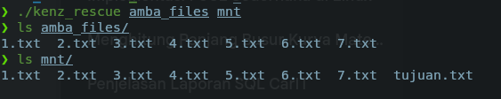  
Passthrough  
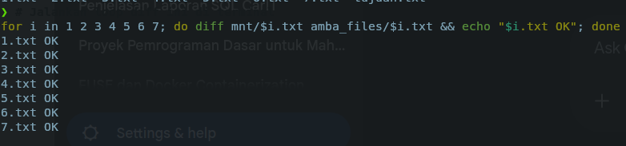  
Tujuan.txt  
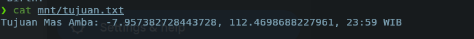  
Mount dilepas  
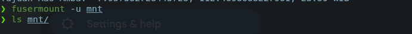  
### Soal 2
Pada soal ini, kita akan membuat sebuah layanan mini database yang terisolasi (containerized) dan terintegrasi dengan sistem penyimpanan yang aman menggunakan mekanisme virtual filesystem. Sistem ini terdiri dari tiga komponen utama: program FUSE untuk enkripsi transparan, kontainer Docker untuk menjalankan service database, dan program client berbasis TCP Socket untuk berinteraksi dengan database.

Solusi yang diimplementasikan harus memenuhi spesifikasi fungsionalitas sebagai berikut:
1. Mekanisme Enkripsi Passthrough FUSE: Program FUSE bertugas menghubungkan direktori fisik asli (encrypted_storage) ke direktori virtual (fuse_mount). Setiap berkas yang ditulis melalui direktori virtual akan dienkripsi secara otomatis menggunakan algoritma XOR dengan kunci 0x76 dan disimpan dengan tambahan ekstensi .enc di direktori fisik. Sebaliknya, saat dibaca melalui direktori virtual, berkas akan terdekripsi secara on-the-fly.
2. Isolasi Layanan (Containerization): Service database utama (server) harus diisolasi ke dalam sebuah image Docker berbasis ubuntu:latest. Direktori virtual FUSE (fuse_mount) akan di-bind mount ke dalam kontainer pada lokasi /app/db sehingga database membaca dan menulis ke sistem berkas yang diamankan oleh FUSE.
3. Interaksi Klien-Server: Komunikasi dengan database dilakukan melalui program client.c yang terhubung via protokol TCP pada port 9000. Program ini mengirimkan perintah (seperti CREATE DATABASE, INSERT, SELECT) dan menerima respon dari server yang berjalan di dalam kontainer.
#### Kode
##### fuse.c
```c
#define FUSE_USE_VERSION 31
#include <fuse.h>
#include <stdio.h>
#include <string.h>
#include <errno.h>
#include <fcntl.h>
#include <unistd.h>
#include <dirent.h>
#include <sys/stat.h>
#include <stdlib.h>

static char dir_asli[4096];
```
Kode fuse.c diawali dengan pendefinisian makro FUSE_USE_VERSION 31 dan penyertaan header standar sistem POSIX seperti <fuse.h>, <dirent.h>, <fcntl.h>, dan <sys/stat.h>. Variabel global statis dir_asli digunakan untuk menyimpan absolute path dari direktori sumber (encrypted_storage) yang didapatkan melalui fungsi realpath() saat program diinisialisasi agar FUSE tidak kehilangan konteks path saat berjalan di latar belakang.
```c
void xor_cipher(char *data, size_t size) {
    for (size_t i = 0; i < size; i++) {
        data[i] ^= 0x76;
    }
}
```
Fungsi xor_cipher(char *data, size_t size) merupakan inti dari sistem keamanan berkas ini. Fungsi ini melakukan iterasi pada setiap byte data dan menerapkan operasi bitwise XOR (^=) dengan kunci statis 0x76. Karena sifat XOR yang simetris, fungsi yang sama digunakan baik untuk mengenkripsi data saat proses penulisan maupun mendekripsi data saat proses pembacaan.
```c
static int xmp_getattr(const char *path, struct stat *stbuf) {
    char fpath[1024];
    if (strcmp(path, "/") == 0) {
        sprintf(fpath, "%s", dir_asli);
    } else {
        sprintf(fpath, "%s%s.enc", dir_asli, path);
        if (access(fpath, F_OK) == -1) {
            sprintf(fpath, "%s%s", dir_asli, path); 
        }
    }
    int res = lstat(fpath, stbuf);
    if (res == -1) return -errno;
    return 0;
}
```
Mencegat permintaan atribut berkas. Memanipulasi path dengan menambahkan .enc lalu meneruskannya ke lstat pada direktori fisik asli.
```c
static int xmp_readdir(const char *path, void *buf, fuse_fill_dir_t filler,
                       off_t offset, struct fuse_file_info *fi) {
    char fpath[1024];
    sprintf(fpath, "%s%s", dir_asli, path);
    DIR *dp = opendir(fpath);
    struct dirent *de;
    if (dp == NULL) return -errno;

    while ((de = readdir(dp)) != NULL) {
        struct stat st;
        memset(&st, 0, sizeof(st));
        st.st_ino = de->d_ino;
        st.st_mode = de->d_type << 12;

        char name[256];
        strcpy(name, de->d_name);
        char *ext = strstr(name, ".enc");
        if (ext) *ext = '\0';

        if (filler(buf, name, &st, 0)) break;
    }
    closedir(dp);
    return 0;
}
```
Mengisi daftar berkas saat direktori dibuka. Membaca folder fisik, dan secara dinamis menyembunyikan/menghapus string .enc pada nama berkas sebelum ditambahkan ke buffer via callback filler.
```c
static int xmp_read(const char *path, char *buf, size_t size, off_t offset,
                    struct fuse_file_info *fi) {
    char fpath[1024];
    sprintf(fpath, "%s%s.enc", dir_asli, path);
    int fd = open(fpath, O_RDONLY);
    if (fd == -1) return -errno;
    int res = pread(fd, buf, size, offset);
    if (res == -1) res = -errno;
    else xor_cipher(buf, res);
    close(fd);
    return res;
}
```
Menangani pembacaan berkas. Fungsi membaca isi fisik terenkripsi menggunakan pread, lalu melewatkan data tersebut ke xor_cipher untuk didekripsi di memori (on-the-fly) sebelum dikembalikan ke pengguna.
```c
static int xmp_write(const char *path, const char *buf, size_t size,
                     off_t offset, struct fuse_file_info *fi) {
    char fpath[1024];
    sprintf(fpath, "%s%s.enc", dir_asli, path);
    int fd = open(fpath, O_WRONLY);
    if (fd == -1) return -errno;
    
    char *enc_buf = malloc(size);
    memcpy(enc_buf, buf, size);
    xor_cipher(enc_buf, size);
    
    int res = pwrite(fd, enc_buf, size, offset);
    free(enc_buf);
    if (res == -1) res = -errno;
    close(fd);
    return res;
}
```
Menangani penulisan berkas. Mencegat data mentah, melakukan enkripsi XOR di memori, dan menuliskannya ke berkas fisik berekstensi .enc via pwrite.
```c
static int xmp_mkdir(const char *path, mode_t mode) {
    char fpath[1024];
    sprintf(fpath, "%s%s", dir_asli, path);
    int res = mkdir(fpath, mode);
    if (res == -1) return -errno;
    return 0;
}
```
Meneruskan perintah pembuatan direktori ke encrypted_storage (direktori tidak dienkripsi/diubah namanya, hanya isi filenya).
```c
static int xmp_create(const char *path, mode_t mode, struct fuse_file_info *fi) {
    char fpath[1024];
    sprintf(fpath, "%s%s.enc", dir_asli, path);
    int res = open(fpath, fi->flags, mode);
    if (res == -1) return -errno;
    fi->fh = res;
    return 0;
}

static int xmp_rmdir(const char *path) {
    char fpath[1024];
    sprintf(fpath, "%s%s", dir_asli, path);
    int res = rmdir(fpath);
    if (res == -1) return -errno;
    return 0;
}
```
Untuk memodifikasi database nya.
##### Dockerfile & client.c
```Dockerfile
FROM ubuntu:latest
RUN apt-get update && apt-get install -y libc6
WORKDIR /app
COPY ./server /app/server
RUN chmod +x /app/server
EXPOSE 9000
CMD ["./server"]
```
Mengonstruksi lingkungan dengan menyalin executable server ke /app/server, memberikan izin eksekusi (chmod +x), dan mengekspos port 9000.
```c
#include <stdio.h>
#include <sys/socket.h>
#include <arpa/inet.h>
#include <unistd.h>
#include <string.h>

int main() {
    int sock = 0;
    struct sockaddr_in serv_addr;
    char buffer[1024] = {0};
    char message[1024];

    if ((sock = socket(AF_INET, SOCK_STREAM, 0)) < 0) return -1;

    serv_addr.sin_family = AF_INET;
    serv_addr.sin_port = htons(9000);

    if (inet_pton(AF_INET, "127.0.0.1", &serv_addr.sin_addr) <= 0) return -1;
    if (connect(sock, (struct sockaddr *)&serv_addr, sizeof(serv_addr)) < 0) return -1;

    while(1) {
        printf("db > ");
        if (fgets(message, 1024, stdin) == NULL) break;
        message[strcspn(message, "\n")] = 0;
        
        if (strcmp(message, "exit") == 0) break;

        send(sock, message, strlen(message), 0);
        int valread = read(sock, buffer, 1024);
        if (valread > 0) {
            printf("%s\n", buffer);
        }
        memset(buffer, 0, 1024);
    }
    close(sock);
    return 0;
}
```
 Membentuk koneksi TCP ke 127.0.0.1:9000. Mengimplementasikan perulangan tanpa henti (infinite loop) untuk membaca perintah pengguna via fgets, mengirimnya via send, dan mencetak balasan server via read.
 #### Output
Mount Berhasil  
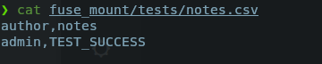  
Client  
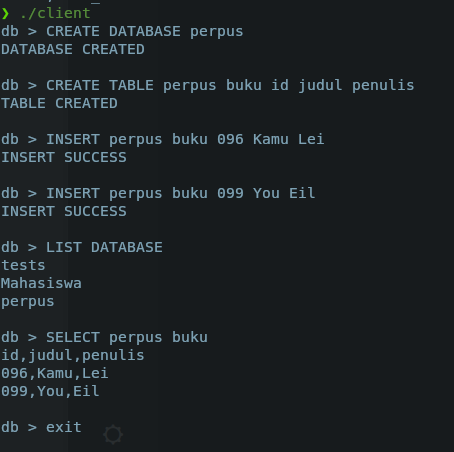  
Tabel  
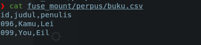  
Enkripsi  
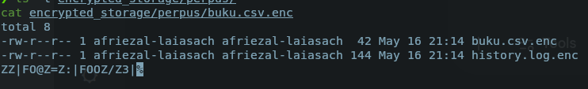  
#### Kendala
- perintah DROP tidak berjalan dengan baik(Database tidak terhapus)
 ### Soal 3
 pada soal ini,  kita membuat sebuah program untuk kebutuhan pembangunan infrastruktur digital untuk "IT Library Nusantara", sebuah perpustakaan khusus bidang Teknologi Informasi. Perpustakaan ini membutuhkan sistem pengelolaan koleksi berkas elektronik (e-book, paper riset, source code, dan dokumentasi) yang terstruktur, aman, serta dapat diakses bersama melalui jaringan. Tugas utama sebagai System Administrator adalah membangun infrastruktur server dari nol menggunakan teknologi Docker dan Samba dengan fungsionalitas dan aturan keamanan ( permission ) sebagai berikut:

1. Otomatisasi Penuh (Zero Manual Setup): Server harus siap pakai begitu container dijalankan (melalui docker-compose up). Seluruh pembuatan direktori, grup, pengguna, serta pengaturan permission harus diotomatisasi.

2. Manajemen Pengguna dan Grup: Terdapat dua kelompok akses yaitu readonly dan staff. Sistem harus mengenali tiga pengguna bawaan: member (password: member123) $\rightarrow$ Kelompok readonly, contributor (password: contrib456) $\rightarrow$ Kelompok staff,  librarian (password: lib789) $\rightarrow$ Kelompok staff

3. Aturan Hak Akses Koleksi (Samba & Host): ebooks & papers: staff memiliki hak baca-tulis, sedangkan readonly hanya hak baca, sourcecode: Hanya staff yang dapat mengakses. Bagi readonly, direktori ini tidak boleh terlihat sama sekali (hidden). Pada sisi host, direktori hanya dapat diakses oleh pemilik dan grupnya (permission 750), docs: Dapat dibaca oleh semua kelompok, namun hanya librarian yang dapat menulis (meskipun contributor adalah staff, ia tidak bisa menulis). Pada sisi host, direktori bersifat read-only agar tidak bisa dimodifikasi dari luar container.

4. Sistem Pemantauan (Audit Logging): Dibutuhkan sebuah service tambahan bernama libraryit-logger yang mencatat aktivitas Samba secara real-time dengan format spesifik: [YYYY-MM-DD HH:MM:SS] [LEVEL] [USERNAME] [AKSI] [NAMA FILE/SHARE]. Level INFO digunakan untuk aktivitas normal dan WARNING untuk percobaan akses yang ditolak (DENIED).

#### Kode
```yml
version: '3.8'

services:
  libraryit-server:
    build: .
    container_name: libraryit-server
    ports:
      - "139:139"
      - "445:445"
    volumes:
      - ./data:/libraryit
      - ./logs:/var/log/samba
    entrypoint: ["/entrypoint.sh", "server"]
    restart: unless-stopped

  libraryit-logger:
    build: .
    container_name: libraryit-logger
    depends_on:
      - libraryit-server
    volumes:
      - ./logs:/var/log/samba
    entrypoint: ["/entrypoint.sh", "logger"]
    restart: unless-stopped
```
Berkas ini bertindak sebagai manajer layanan. Ia membangun image dari direktori saat ini (build: .) dan mendefinisikan dua service:
- libraryit-server: Mengekspos port 139 dan 445 untuk protokol SMB. Container ini memetakan dua volume: ./data untuk penyimpanan file persisten dan ./logs untuk berbagi berkas log dengan logger. Layanan ini dijalankan dengan argumen entrypoint "server".
- libraryit-logger: Berjalan bergantung pada server (depends_on). Memetakan volume log yang sama dan dijalankan dengan argumen entrypoint "logger".
```sh
#!/bin/bash

if [ "$1" = "logger" ]; then
    LOG_FILE="/var/log/samba/libraryit.log"
    
    mkdir -p /var/log/samba
    touch "$LOG_FILE"
    
    tail -F "$LOG_FILE" | while read -r line; do
        if echo "$line" | grep -q "smbd_audit:"; then
            DATA=$(echo "$line" | awk -F'smbd_audit: ' '{print $2}')
            USER=$(echo "$DATA" | cut -d'|' -f1)
            SHARE=$(echo "$DATA" | cut -d'|' -f3)
            ACTION=$(echo "$DATA" | cut -d'|' -f4)
            STATUS=$(echo "$DATA" | cut -d'|' -f5)
            
            LEVEL="INFO"
            AKSI=$(echo "$ACTION" | tr '[:lower:]' '[:upper:]')
            
            if [[ "$STATUS" == "fail" || "$STATUS" == "failed" ]]; then
                LEVEL="WARNING"
                AKSI="DENIED"
            elif [[ "$ACTION" == "connect" ]]; then
                AKSI="CONNECT"
            fi
            
            NOW=$(date +"%Y-%m-%d %H:%M:%S")
            echo "[$NOW] [$LEVEL] [$USER] [$AKSI] [$SHARE]"
        fi
    done
    exit 0
fi

mkdir -p /var/log/samba
touch /var/log/samba/libraryit.log
echo "local7.* /var/log/samba/libraryit.log" > /etc/rsyslog.d/samba-audit.conf
service rsyslog start

groupadd readonly || true
groupadd staff || true

useradd -M -s /usr/sbin/nologin -g readonly member || true
useradd -M -s /usr/sbin/nologin -g staff contributor || true
useradd -M -s /usr/sbin/nologin -g staff librarian || true

(echo "member123"; echo "member123") | smbpasswd -a -s member
(echo "contrib456"; echo "contrib456") | smbpasswd -a -s contributor
(echo "lib789"; echo "lib789") | smbpasswd -a -s librarian

mkdir -p /libraryit/ebooks
mkdir -p /libraryit/papers
mkdir -p /libraryit/sourcecode
mkdir -p /libraryit/docs

chown -R root:staff /libraryit/ebooks /libraryit/papers
chmod -R 775 /libraryit/ebooks /libraryit/papers

chown -R root:staff /libraryit/sourcecode
chmod -R 750 /libraryit/sourcecode

chown -R librarian:staff /libraryit/docs
chmod -R 755 /libraryit/docs

exec smbd -F --no-process-group
```
Berkas skrip bash ini adalah inti dari sistem otomatisasi, yang terbagi menjadi dua blok logika:
Mode Logger
 mencegat eksekusi untuk menjalankan fungsi monitoring. Skrip menggunakan perintah tail -F pada libraryit.log dan memfilter keluaran yang mengandung smbd_audit:. String mentah kemudian diproses menggunakan utilitas awk dan cut untuk mengekstrak identitas pengguna, nama share, aksi, dan status. Logika percabangan (if/elif) digunakan untuk memetakan status fail menjadi format WARNING dan DENIED.
Mode Server
Melakukan inisialisasi lingkungan. Skrip menyalakan daemon rsyslog untuk menangkap audit log, membuat grup, dan membuat pengguna tanpa akses shell Linux (/usr/sbin/nologin) demi keamanan. Selanjutnya, kata sandi Samba diatur menggunakan smbpasswd. Bagian akhir skrip menerapkan pembatasan pada sisi host menggunakan perintah chmod (misal: 750 untuk sourcecode) dan chown (menetapkan librarian:staff pada direktori docs).
```conf
[global]
    workgroup = WORKGROUP
    server string = LibraryIT Server
    security = user
    map to guest = never
    access based share enum = yes 

    vfs objects = full_audit
    full_audit:prefix = %u|%I|%S
    full_audit:success = connect read write pread pwrite rename mkdir rmdir
    full_audit:failure = connect read write pread pwrite rename mkdir rmdir
    full_audit:facility = local7
    full_audit:priority = notice

[ebooks]
    path = /libraryit/ebooks
    valid users = @staff, @readonly
    write list = @staff
    read list = @readonly
    browseable = yes
    guest ok = no

[papers]
    path = /libraryit/papers
    valid users = @staff, @readonly
    write list = @staff
    read list = @readonly
    browseable = yes
    guest ok = no

[sourcecode]
    path = /libraryit/sourcecode
    valid users = @staff
    browseable = yes
    guest ok = no

[docs]
    path = /libraryit/docs
    valid users = @staff, @readonly
    write list = librarian 
    browseable = yes
    guest ok = no
```
Berkas ini mendefinisikan regulasi akses direktori secara spesifik:
- access based share enum = yes: Direktif ini diimplementasikan pada bagian [global] untuk menyembunyikan share jaringan apabila pengguna yang masuk tidak memiliki hak akses (valid users) ke share tersebut, memenuhi kriteria penyembunyian direktori sourcecode.
- Modul vfs objects = full_audit: Diaktifkan untuk merekam seluruh operasi baca, tulis, sukses, maupun gagal ke dalam fasilitas syslog.
- Aturan Akses Spesifik ([docs]): Diatur dengan parameter valid users = @staff, @readonly dan secara spesifik dideklarasikan write list = librarian guna menganulir izin tulis dari anggota grup staff lainnya.
#### Output
Bukti Pembuatan User & Direktori  
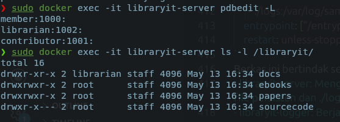  
Bukti Visibilitas & Keamanan sourcecode  
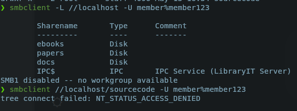  
Bukti Aturan Tulis  
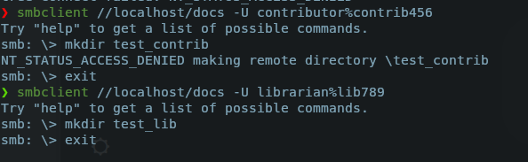  
Bukti Keamanan Izin Host  
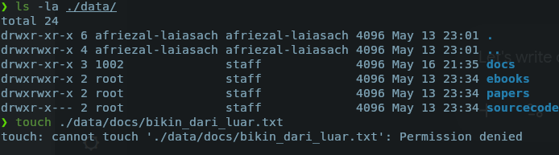  
#### Kendala
- Log tidak bekerja